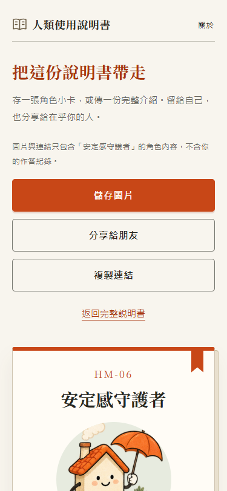

# 人類使用說明書

> 出廠時沒附的那本，現在補給你。

8 個日常選擇，翻開一份娛樂角色使用說明書。繁體中文、免登入、手機優先。

目前是**試玩版**，可以完成測驗、保存進度、儲存角色圖片及分享結果。不是心理評估或醫療診斷。

[開啟線上試玩](https://mikeggyy.github.io/human-manual/) · [GitHub 原始碼](https://github.com/mikeggyy/human-manual) · [發布紀錄](https://github.com/mikeggyy/human-manual/actions)

## 技術與協作

使用者確認手冊風格後，要求選用適合 AI 開發的方式；現採 React 19、TypeScript、Vite、React Router HashRouter、CSS variables。以元件、狀態、資料與計分分層，方便 AI 小步實作與測試。第一版沒有後端、LLM API、會員、追蹤或付費功能。

使用者負責產品與視覺方向；Codex 負責實作、測試與文件。視覺概念和書冊／電池插畫由內建 imagegen 產生；頁面文字、表單與控制項皆為 HTML。完整進度見 [實作計畫](docs/IMPLEMENTATION-PLAN.md)。

## 已實作的基礎

- 首頁、8 題單選、返回修改、未答不可前進、完整六角色結果與重測。
- 此瀏覽器保存作答與題號；重整可接續，完成後可從首頁重新查看。損壞、版本不合或瀏覽器禁止儲存時仍可作答並顯示提示。
- 角色模板分享頁、1080×1350 PNG 小卡、原生分享（瀏覽器支援時）及複製連結。取消分享正常返回，複製不可用時顯示可選取網址。
- 分享 URL 僅含版本和角色；未知版本／角色／路由可回首頁。
- 原生 radio 與 fieldset、鍵盤焦點、375 / 768 / 1440px 響應式樣式。
- 每題專屬情境插圖、六角色獨立造型，關於與錯誤頁也有插圖；分段進度、手機底部操作列與紙卡分享版面。
- 精裝書主視覺、角色書籤、結果揭曉效果；六種完整生活場景、相處提醒、充電小練習與結尾。自己完成測驗後可看實際答案線索和完整作答回顧，分享頁不含個人答案。
- 各頁／角色專屬分頁標題、共用品牌分享圖、導覽與頁尾、JavaScript 提示及異常回復入口。
- 結果先呈現基本設定，再看個人作答線索和生活篇章；章節可跳讀。手機分享操作位於卡片前方，PNG 產生後另提供圖片預覽與再次下載入口。

## 尚未完成

跨裝置實機與真人驗收：iOS Safari 實機、App 內嵌瀏覽器、3 位一般使用者試玩仍未驗證。原生分享與圖片下載受瀏覽器／作業系統能力影響，不保證自動存入相簿或每種社群都顯示縮圖。

試玩版 Pages 已公開；各版的本機測試、CI 與實際部署結果分別記錄於 [實作計畫](docs/IMPLEMENTATION-PLAN.md)。

## 實際畫面

2026-09-08 公開網站的 375px 手機尺寸截圖（桌面 Edge 模擬）。

 

## 本機執行

使用 Node 24.14.0 或較新的 Node 24，npm 安裝。實際版本以 package-lock.json 為準。

```powershell
cd human-manual
npm ci
npm run dev -- --port 5180
```

開啟 http://127.0.0.1:5180 。預覽 production build 可改用 `npm run build` 然後 `npm run preview -- --port 5180`。

## 驗證

```powershell
npm run typecheck
npm run lint
npm run test:unit
npm run test:core
npm run build
```

瀏覽器測試需要先啟動上面的本機預覽，再於另一個終端執行：

```powershell
# 首次使用 Playwright 的 Chromium 時才安裝。
npx playwright install chromium
npm run test:e2e
```

Windows 也可使用已安裝的 Edge：`$env:PLAYWRIGHT_CHANNEL = 'msedge'`，然後執行 `npm run test:e2e`。測試網址可由 `E2E_BASE_URL` 指定；未指定時為 http://127.0.0.1:5180 。

測試環境為 Windows / Node 24.14.0 / Edge Chromium，另在 Codex 內建瀏覽器檢查互動。2026-09-08 新增保存／清除失敗、PNG 產出／重試、分享取消與手機操作順序回歸；最終實際結果及限制見實作計畫。

## 架構與計分

- `core/quiz.v1.json`：原始版本化題庫與完整角色文案。
- `src/domain`：型別與計分純函式；不依賴 React。
- `src/state`：reducer、context 與 useQuiz。
- `src/pages`、`src/components`：頁面及共用介面。
- `src/services`：分享 URL、版本化保存與驗證、圖片匯出。
- `tests/unit`、`tests/e2e`：計分對照與實際瀏覽器流程。

每題主類型 3 分、副類型 1 分。最高分決定結果，平手由最後一題往前比較。TypeScript 核心已與提供的參考核心比對全部 6,561 種答案，包含 1,781 個平手案例，六角色皆可到達。這不代表心理效度或真實使用者比例。

## 發布與授權

使用者已授權發布到 `mikeggyy/human-manual`。`.github/workflows/deploy.yml` 在 main 更新後執行檢查、建置、瀏覽器測試及 GitHub Pages 發布；實際結果見 Actions 與 [實作計畫](docs/IMPLEMENTATION-PLAN.md)。未指定開源 LICENSE，公開程式碼不代表授予開源授權。操作方式見 [發布說明](docs/DEPLOY.md)。
